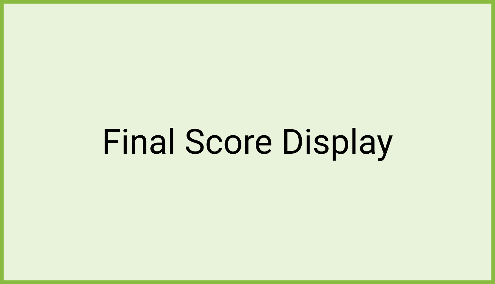

# Final Score Display 
When a scored song reaches the end, the Final Score Display is shown with each final score element building up to the final star rating verdict reflecting the graded performance. 

## Song TTA
The performed song's track title and artist, for context.

## Notes hit %
Notes hit during performance vs total notes, represented as a rounded (no decimals, rounded up at 0.5, rounded down below 0.5) percentage integer.

## Note streak
Displayed as an integer set to the value of the longest uninterrupted sequence of hote hits for that performance.

## Final score
The total score accumulated for that performance, represented as an integer.

## Star rating
A 5-star rating displayed as empty, half-filled and filled stars.

The star rating is a factor of the user score against the max score.

## Final grade
A short message that reflects the quality of the graded performance.

## Score display

| **Score Screen Element**         | **Display**                                                                                                                                               |
|----------------------------------|-----------------------------------------------------------------------------------------------------------------------------------------------------------|
| **Song TTA**                     | The song TTA is displayed to give context to the current screen                                                                                           |
| **Notes hit**                    | First, the notes hit percentage score is displayed as an incrementing percentage                                                                           |
| **Note streak**                  | Then the longest note streak is displayed as an incrementing number                                                                                       |
| **Final score**                  | The final score, which is directly impacted by the note hits and streak, is then displayed as an incrementing number                                       |
| **Final grade and star rating**  | Finally, the final grade is given, and the five stars are gradually filled up to the corresponding star rating (fills in tenth increments up to half or full star display) |

## Score sound FX
| **Score Screen Event**  | **Sound FX** |
|-------------------------|--------------|
| **Star Filling**        |              |
| **Score Incrementing**  |              |
| **Streak Incrementing** |              |
| **Hits Incrementing**   |              |
| **Final Grade**         |              |
| **Background Ambience** |              |

