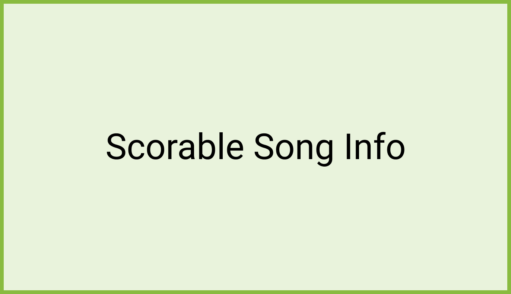

# Scorable Song Info 

Under their TTA metadata, Song Info screens for scorable songs display 5 empty stars for yet unperformed songs. 

## Top score 

A more detailed display of the last top score is displayed for songs previously performed by users: 
- Stars are filled according to score (half-filled increments) 
- The % score is displayed (no decimals, rounded up at .5) 
- The streak score is displayed (longest sequential hits) 
- The points score is displayed 

## Score Song call-to-action 

The most differentiating feature of scorable song info screens is their call-to-action button, Score Song, which allows users to start scoring the song in the player. 