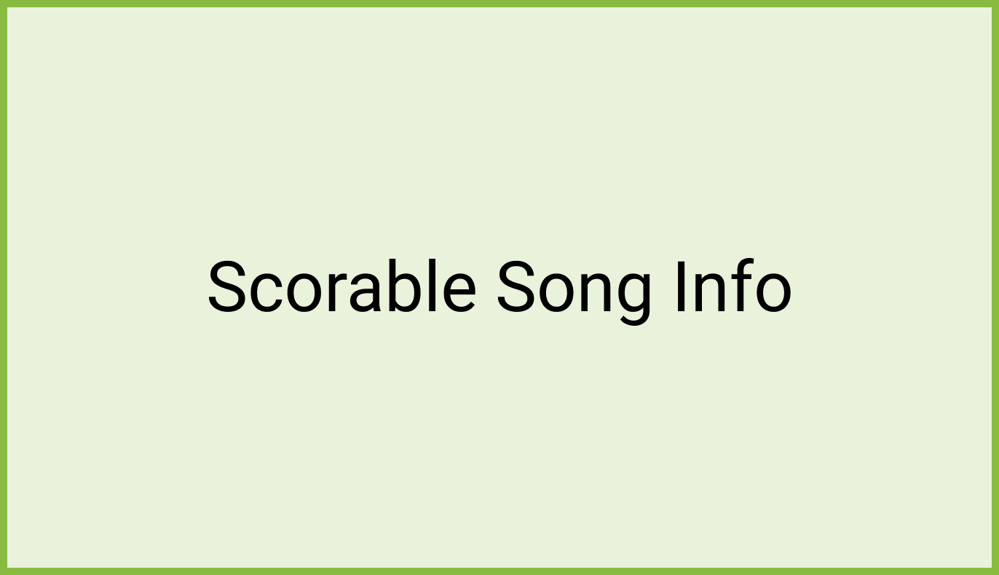

# Scoring a song 

Clicking a scorable song will display its corresponding Song Info screen where users could view their highest score if they previously scored that song. 

:::note

In the case of a previously scored song, users will see their star rating, percentage, longest note streak, and total score. 

:::

## Scoring Call-to-Action 

Most importantly, a scorable song’s Song Info screen features a Score Song call-to-action button alongside the Sing Now and Add to Queue actions.  

Clicking Score Song with a connected microphone brings up the karaoke score player screen with a 3-second countdown before the song starts, allowing users to sing and achieve the best score possible.

:::note

If the app does not detect a microphone, a dialog informs users that they need to connect a microphone to use this feature. 

:::

