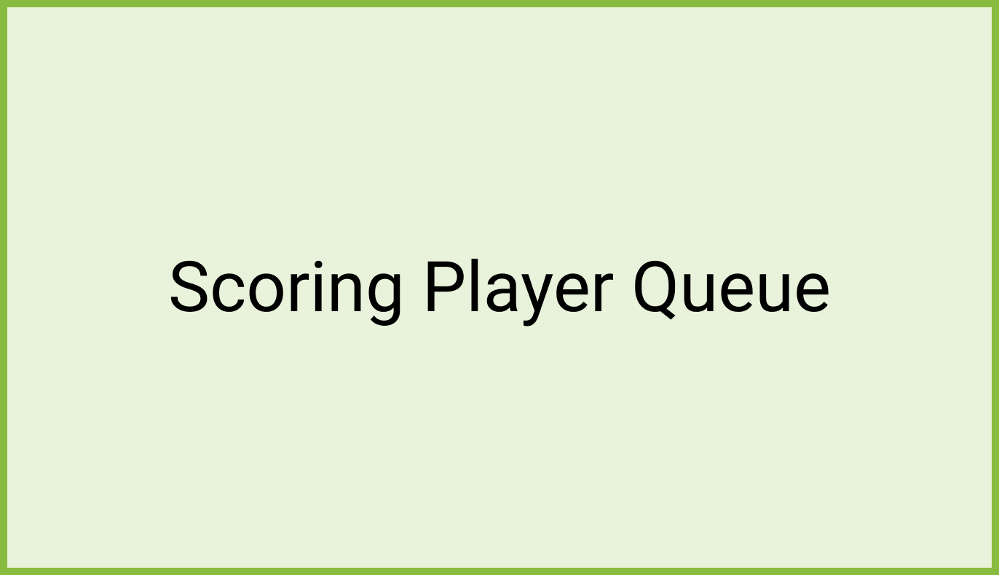

# Scoring and the Song Queue 

On the score display screen, after a scorable song performance, users must select **Continue** or **Retry Song**. 

Clicking **Retry Song** goes back to the start of the same song, staying on the same song queue position, with the countdown animation before the playback starts in score mode. 

Clicking **Continue** moves to the next song queue position.  

If the new current song queue position has a scorable song, the countdown is displayed, and the song is played in score mode. 

If the new current song queue position has a non-scorable song, the song playback starts in sing mode (no countdown). 

When the player is in sing mode because users have manually selected to sing a scorable song in sing mode, both scorable and non-scorable queued songs, are played in sing mode until users click the Score-Sing switch to score a scorable song.  

The player doesn’t automatically switch to score mode when the queue reaches a scorable song if users had previously selected the sing mode. 

:::warning

### Score Player Song Queue

Due to hardware limitations, the Song Queue automatically pauses the Score Player when it is expanded on landscape form factors.

:::