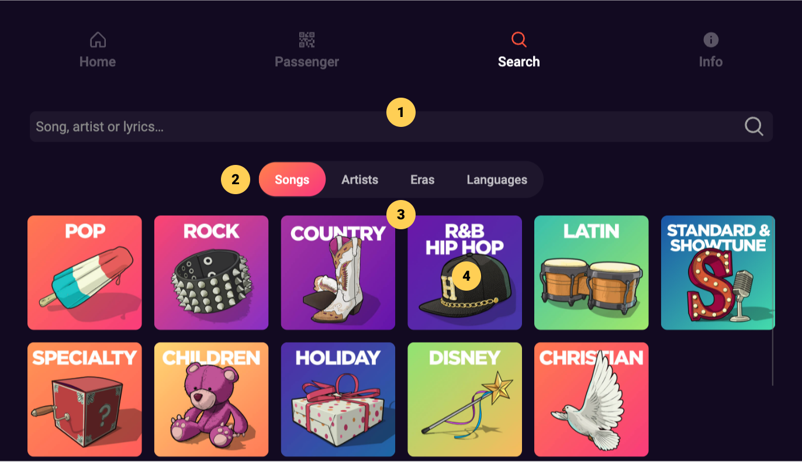
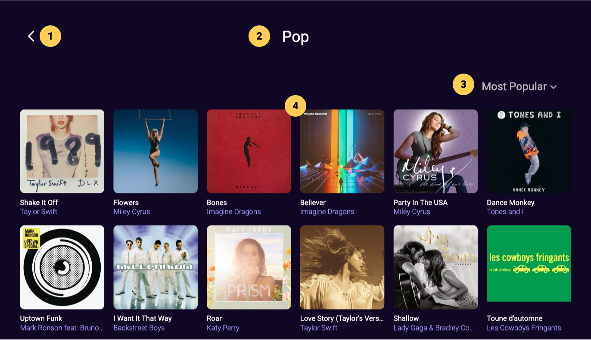
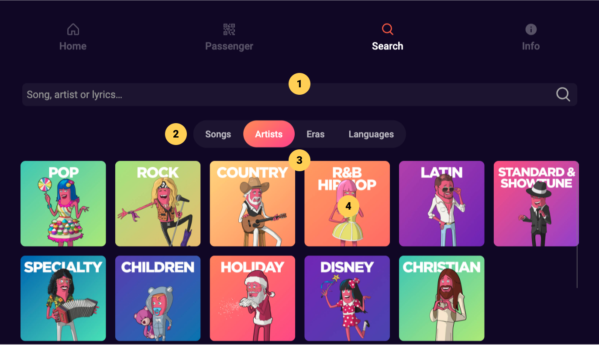
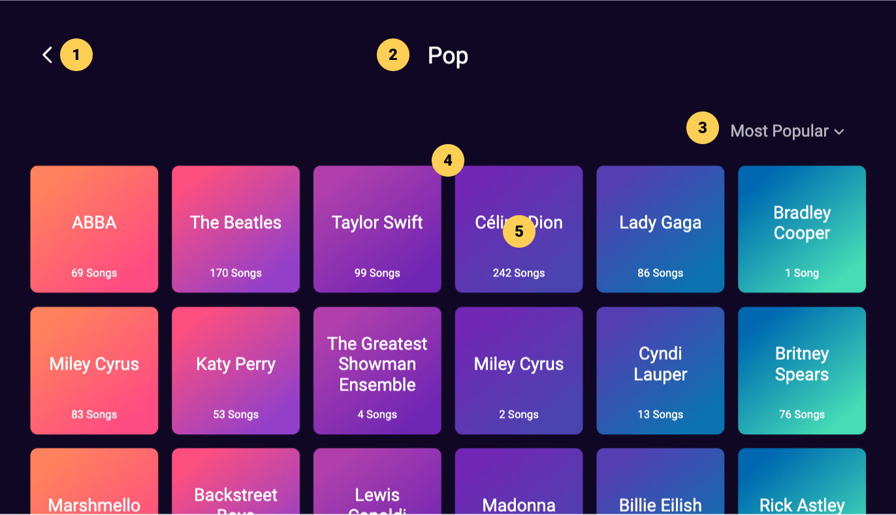
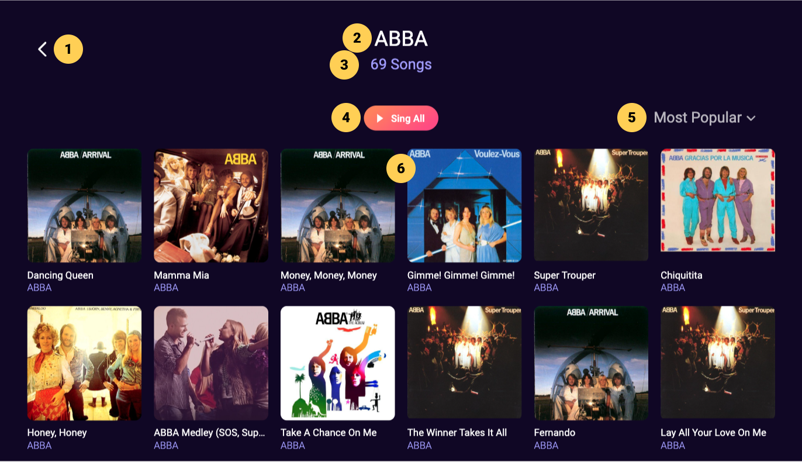
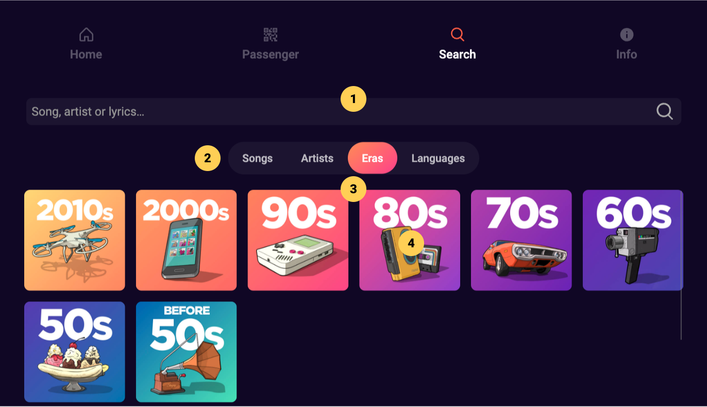
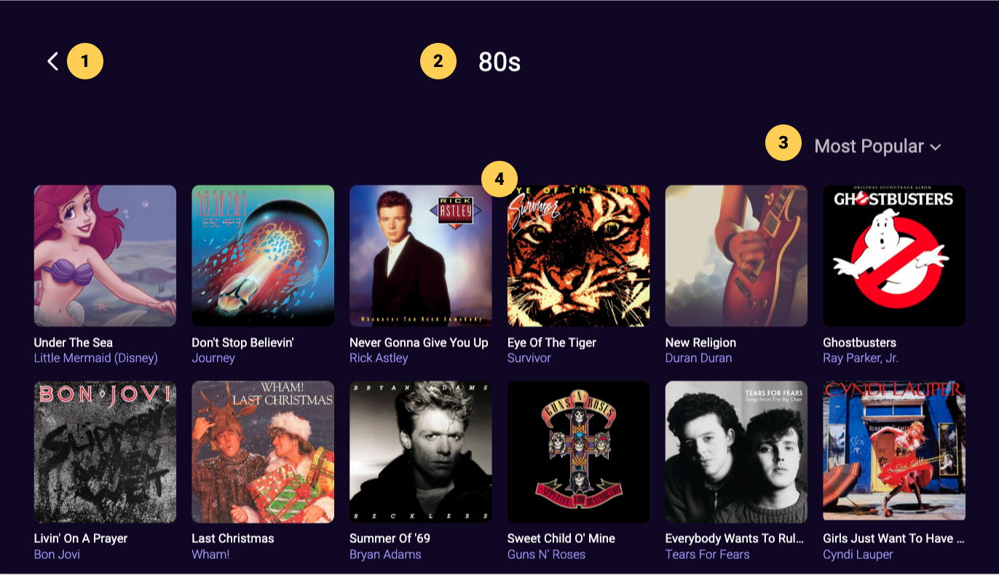
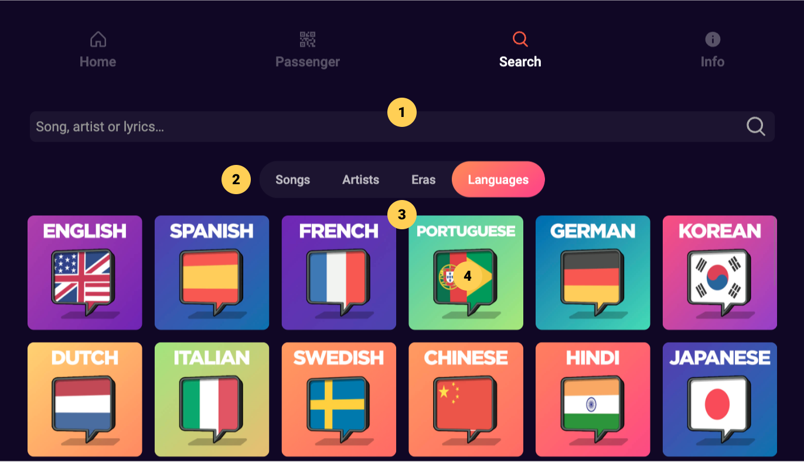
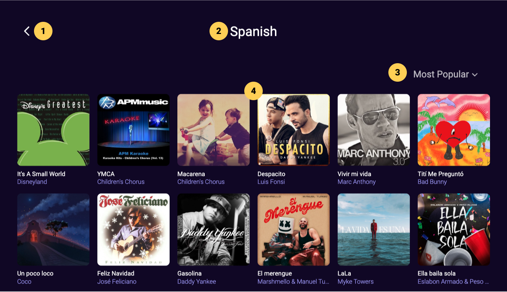

# Browse

## Songs

|   # | Description                                                 |
| --: | :---------------------------------------------------------- |
|     | **Search**                                                  |
|   1 | Search field, click to display on-screen keyboard           |
|     | **Browse Library**                                          |
|   2 | Category tabs, click to filter library by selected category |
|   3 | Subcategories display, scroll to view more subcategories    |
|   4 | Genre tile, click to browse corresponding genre songs       |

:::note

- Songs are presented by genre subcategories
- Click any genre tile (4) to view a corresponding list of songs

:::

## Genre Songs

|   # | Description                                               |
| --: | :-------------------------------------------------------- |
|   1 | Back button, click to go back to previous screen          |
|   2 | Screen title with subcategory name                        |
|   3 | Sort dropdown, click to select a different sorting option |
|   4 | Song cards, scroll to view more                           |

## Artists

|   # | Description                                                 |
| --: | :---------------------------------------------------------- |
|     | **Search**                                                  |
|   1 | Search field, click to display on-screen keyboard           |
|     | **Browse Library**                                          |
|   2 | Category tabs, click to filter library by selected category |
|   3 | Subcategories display, scroll to view more subcategories    |
|   4 | Genre tile, click to browse corresponding artists           |

:::note

- Artists are presented by genre subcategories
- Click any genre tile (4) to view a corresponding list of artists then click an artist to view their list of songs

:::

## Genre Artists

|   # | Description                                                                  |
| --: | :--------------------------------------------------------------------------- |
|   1 | Back button, click to go back to previous screen                             |
|   2 | Screen title with subcategory name                                           |
|   3 | Sort dropdown, click to select a different sorting option                    |
|   4 | Artist cards, scroll to view more                                            |
|   5 | Artist Card with artist name and number of songs, click to view artist songs |

## Artist Songs

|   # | Description                                                         |
| --: | :------------------------------------------------------------------ |
|   1 | Back button, click to go back to previous screen                    |
|   2 | Screen title with artist name                                       |
|   3 | Number of songs available by selected artist in the karaoke library |
|   4 | Sing All button, click to add all artist songs to the Song Queue    |
|   5 | Sorting dropdown menu, click to change sorting order                |
|   6 | Song Cards, scroll to view more artist songs                        |

## Eras

|   # | Description                                                 |
| --: | :---------------------------------------------------------- |
|     | **Search**                                                  |
|   1 | Search field, click to display on-screen keyboard           |
|     | **Browse Library**                                          |
|   2 | Category tabs, click to filter library by selected category |
|   3 | Subcategories display, scroll to view more subcategories    |
|   4 | Subcategory tile, click to browse corresponding content     |

:::note

- Eras are presented by decade subcategories
- Click any decade tile (4) to view a corresponding list of songs

:::

## Era Songs

|   # | Description                                               |
| --: | :-------------------------------------------------------- |
|   1 | Back button, click to go back to previous screen          |
|   2 | Screen title with era name                                |
|   3 | Sort dropdown, click to select a different sorting option |
|   4 | Song cards, scroll to view more                           |

## Languages

|   # | Description                                                 |
| --: | :---------------------------------------------------------- |
|     | **Search**                                                  |
|   1 | Search field, click to display on-screen keyboard           |
|     | **Browse Library**                                          |
|   2 | Category tabs, click to filter library by selected category |
|   3 | Subcategories display, scroll to view more subcategories    |
|   4 | Subcategory tile, click to browse corresponding content     |

:::note

- Languages presented by subcategories
- Click any language tile (4) to view a corresponding list of songs

:::

## Language Songs

|   # | Description                                               |
| --: | :-------------------------------------------------------- |
|   1 | Back button, click to go back to previous screen          |
|   2 | Screen title with language name                           |
|   3 | Sort dropdown, click to select a different sorting option |
|   4 | Song cards, scroll to view more                           |
