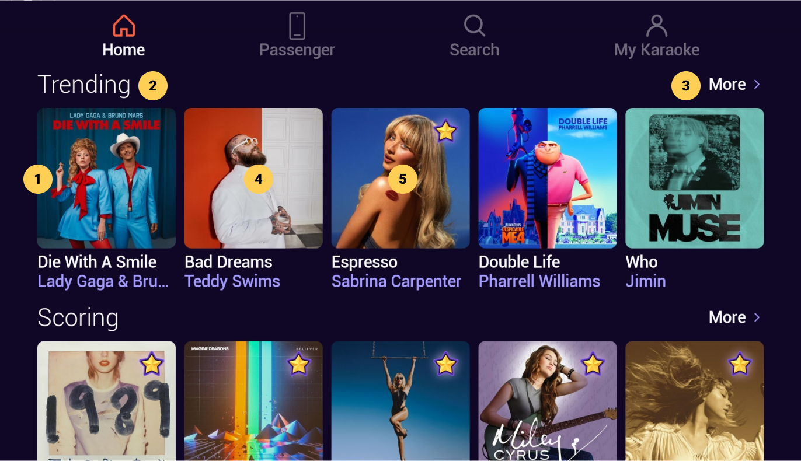

# Home

|   # | Description                                                                                                            |
| --: | :--------------------------------------------------------------------------------------------------------------------- |
|     | **Swimlanes**                                                                                                          |
|   1 | Category swimlane with header and row of Song or Party Mix cards                                                       |
|   2 | Category name, click to display more category content                                                                  |
|   3 | More button, click to display more category content                                                                  |
|     | **Song Card**                                                                                                          |
|   4 | Song Card with thumbnail image, white title label and color (lavender) artist label, click to display [Song Info](./Song%20Info.md) screen |
|     | **Scorable Song Card**                                                                                                     |
|   5 | Same as Song Card (above) with scorable song icon in top right corner, click to display [Scorable Song Info](../Scoring/Scorable%20Song%20Info.md) screen |

&nbsp;

:::info
- The purpose of the Home section is to display recommended and editorial content
- The number of cards displayed in a swimlane is dependent on the form factor of the device
:::

<!-- Favorites and History swimlanes (appear on Home when populated) -->

:::tip
- Clicking the category title (2) or the **More** button (3) has the same behavior: display a screen with more corresponding content
:::