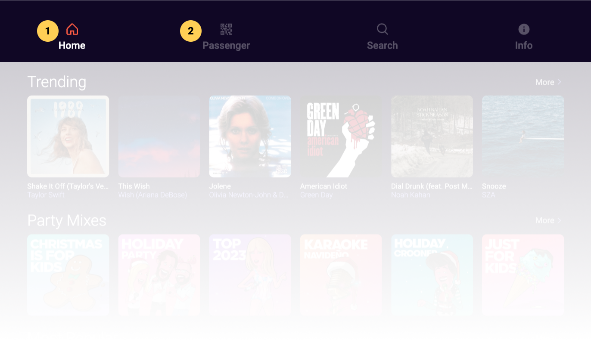

# Main Menu

### Adaptive Main Menu
The main menu is displayed as a vertical bar to the left or right side of the screen on landscape form factors whereas it is displayed as a horizontal bar at the top or bottom of the screen on portrait form factors.

When displayed as a vertical bar, the main menu can be expanded by clicking on the burger menu icon to display the main menu icon labels.

|   # | Description                                                        |
| --: | :----------------------------------------------------------------- |
|   1 | Selected (current) menu item                                       |
|   2 | Idle menu items, click to display corresponding screen and content |

&nbsp;

:::info

- Selecting any main menu item displays the corresponding app section and content
- The current section’s menu item is highlighted with an accent color (orange) icon and a white label whereas other menu items are grey

:::
