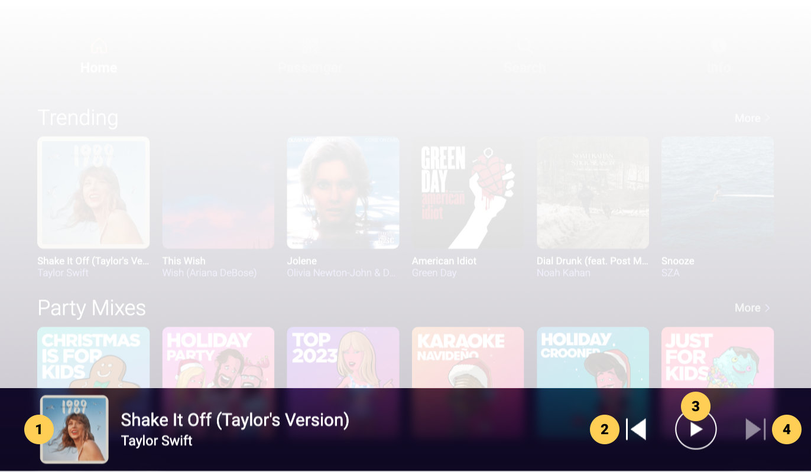

# Mini Player

|   # | Description                                                                                            |
| --: | :----------------------------------------------------------------------------------------------------- |
|   1 | Song thumbnail and TTA, click to expand to full screen [Player](/docs/Screen%20Descriptions/Player) |
|   2 | Back, click within first 3 secs to play previous song (if any), else click to restart current song     |
|   3 | Play / Pause toggle button, click to play or pause current song playback                               |
|   4 | Skip, click to skip current song and start playing next song (if any)                                  |

&nbsp;

:::tip

- Click the Mini Player to expand it to the full screen [Player](/docs/Screen%20Descriptions/Player)

:::

:::note

- The Mini Player is only displayed when there is at least one song in the [Song Queue](/docs/Screen%20Descriptions/Song%20Queue) of the [Player](/docs/Screen%20Descriptions/Player)
- The Mini Player is anchored at the bottom of most app screens, providing a quick shortcut to the [Player](/docs/Screen%20Descriptions/Player) from anywhere in the app

:::

:::info

- The Back button is disabled within the first 3 seconds of the current song if there is no previous song in the queue
- After the first 3 seconds of the current song, users can double-click the Back button twice to start the previous song playback (if any)
- The Skip button is disabled if the current song is the last song in the queue

:::
