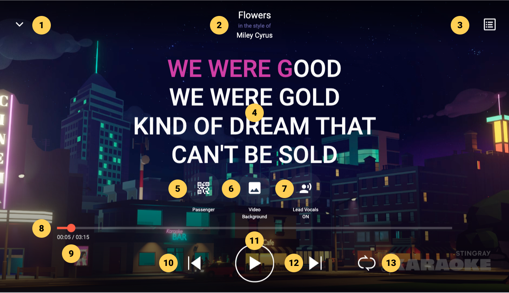
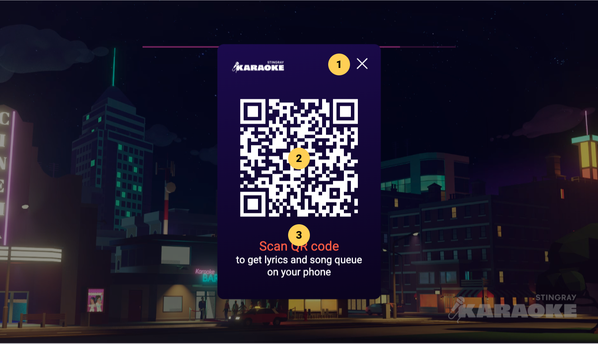
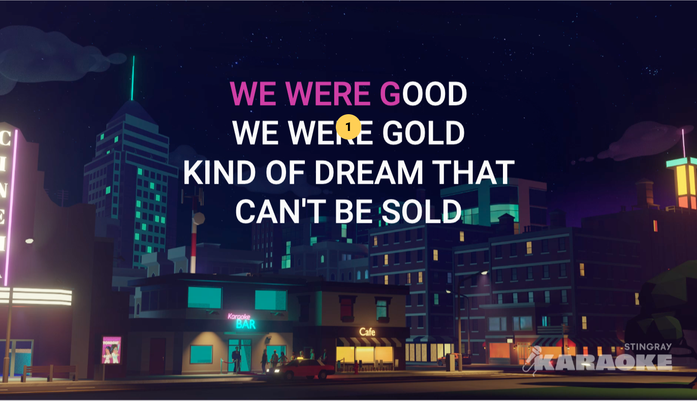
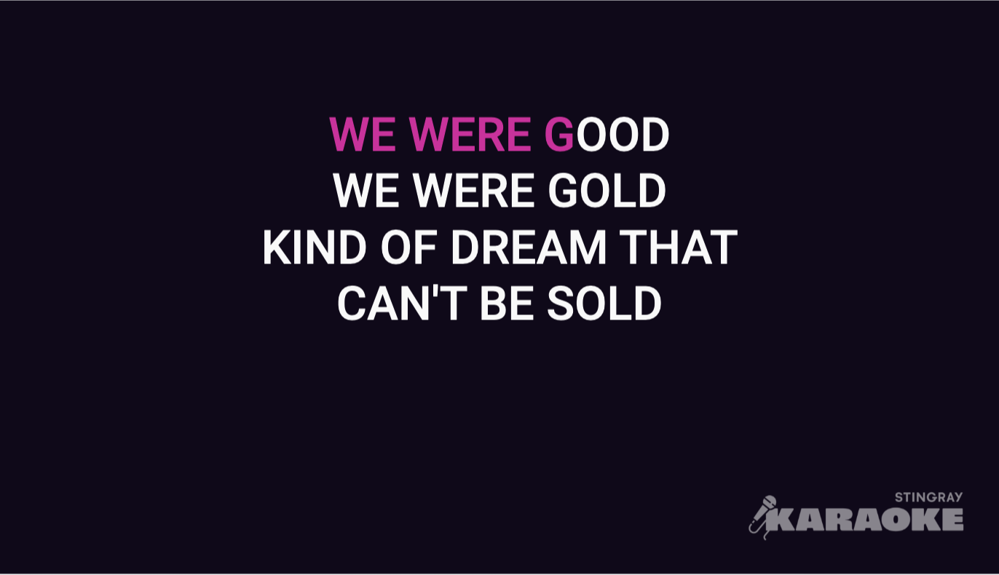
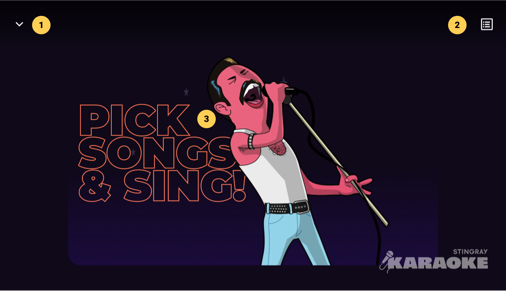

# Player

## Active State (Controls Display)

|   # | Description                                                                                                                                 |
| --: | :------------------------------------------------------------------------------------------------------------------------------------------ |
|   1 | Player collapse button, click to minimize the full screen player to its [mini player](/docs/Screen%20Descriptions/Mini%20Player) version |
|   2 | Current song TTA info display                                                                                                               |
|   3 | [Song Queue](/docs/Screen%20Descriptions/Song%20Queue) button, click to display current song queue in side drawer                        |
|   4 | Song lyrics                                                                                                                                 |
|   5 | Passenger button, click to display the Passenger app [QR code dialog](#passenger-app-dialog)                                                |
|   6 | Video Background toggle button, click to toggle between video backgrounds and [lyrics on black](#lyrics-on-black)                           |
|   7 | Lead Vocals toggle button, click to toggle lead vocals audio on an off                                                                      |
|   8 | Song Progress Bar, click the scrub handle to move through the song timeline back and forth                                                  |
|   9 | Time display for current position / duration                                                                                                |
|  10 | Back, click within first 3 secs to play previous song (if any), else click to restart current song                                          |
|  11 | Play / Pause toggle button, click to play or pause current song playback                                                                    |
|  12 | Skip, click to skip current song and start playing next song (if any)                                                                       |
|  13 | Loop three-way toggle, click to turn on queue looping, click again to loop single (current) song, click again to turn off                   |

:::danger

The Video Background toggle button (6) has been deprecated on later app versions

:::

:::tip

- Users have access to the [Song Queue](/docs/Screen%20Descriptions/Song%20Queue) (3) from the full screen player so they can manage it without interrupting the experience

:::

:::note

- The Passenger button (5) displays the passenger app [QR code dialog](#passenger-app-dialog)
- The full screen player can be collapsed (1) to the [Mini Player](/docs/Screen%20Descriptions/Mini%20Player) , enabling navigation within the app without playback interruption
- Player controls and other UI elements fade out after 3 seconds of [idle](#idle-state-controls-auto-hide) time; they fade back in with a click anywhere on the player screen

:::

## Passenger App Dialog

|   # | Description                                       |
| --: | :------------------------------------------------ |
|   1 | Close button, click to close dialog               |
|   2 | QR code, scan with device to join current session |
|   3 | Scan QR code prompt message                       |

:::tip

- Passengers can scan the QR code to get the Passenger app, enabling lyrics display and song queue management on their device

:::

## Idle State (Controls Auto Hide)

|   # | Description |
| --: | :---------- |
|   1 | Song lyrics |

:::note

- Unobstructed viewing experience allowsusers to see the media without any distractions from the player controls

:::

:::tip

- Click anywhere to go back to the [active](#active-state-controls-display) state, enabling player controls and other UI elements display

:::

## Lyrics on Black

:::danger

Lyrics on Black (6) has been deprecated on later app versions

:::

:::note

- Lyrics on Black mode available by clicking the Video Background / Lyrics on Black toggle button for users who want a more classic karaoke experience without any distraction

:::

## Empty Song Queue

|   # | Description                                                                                                                                 |
| --: | :------------------------------------------------------------------------------------------------------------------------------------------ |
|   1 | Player collapse button, click to minimize the full screen player to its [mini player](/docs/Screen%20Descriptions/Mini%20Player.md) version |
|   2 | Song Queue button, click to display current [song queue](/docs/Screen%20Descriptions/Song%20Queue.md) in side drawer                        |
|   3 | Pick songs prompt and illustration                                                                                                          |

:::note

- Player controls are not displayed when the song queue is empty

:::
