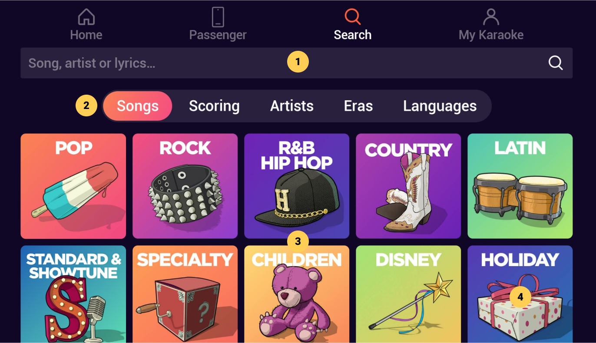
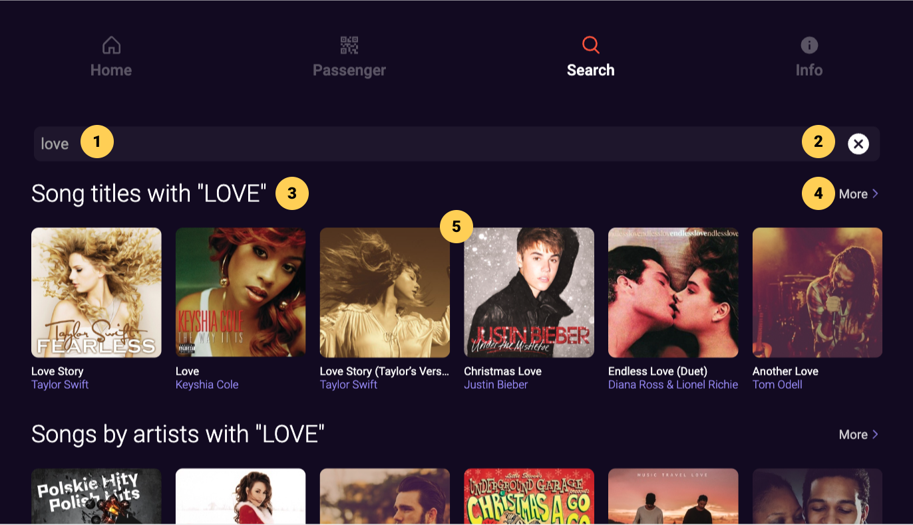
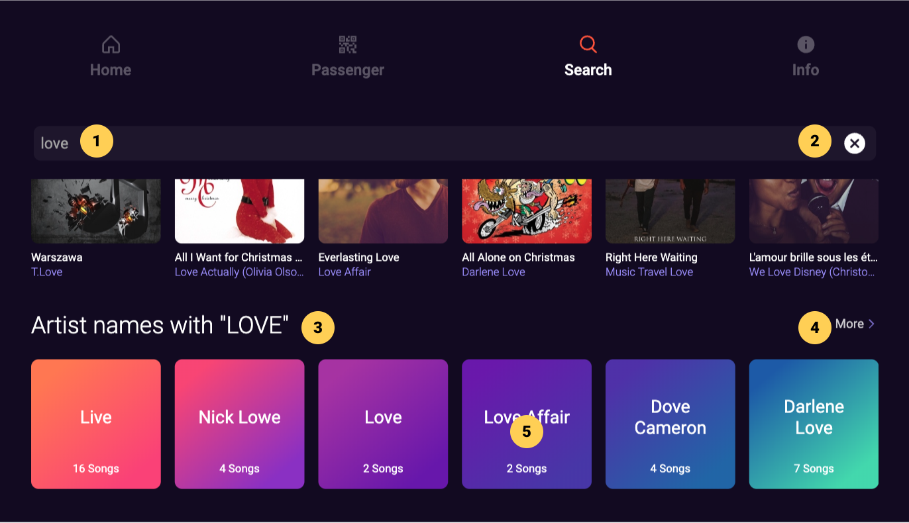
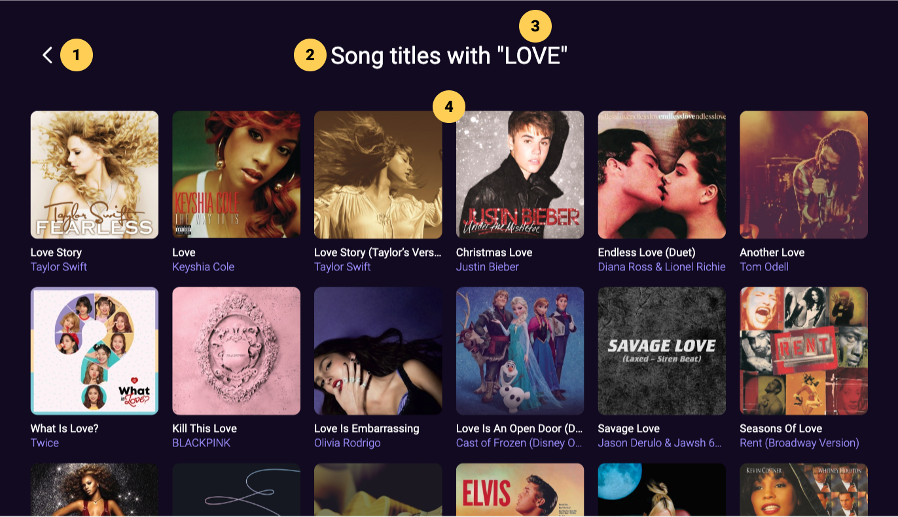
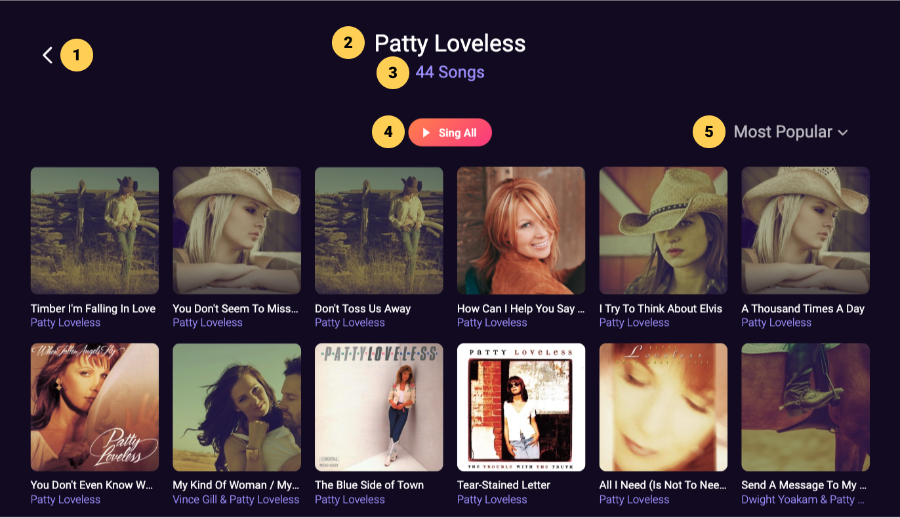
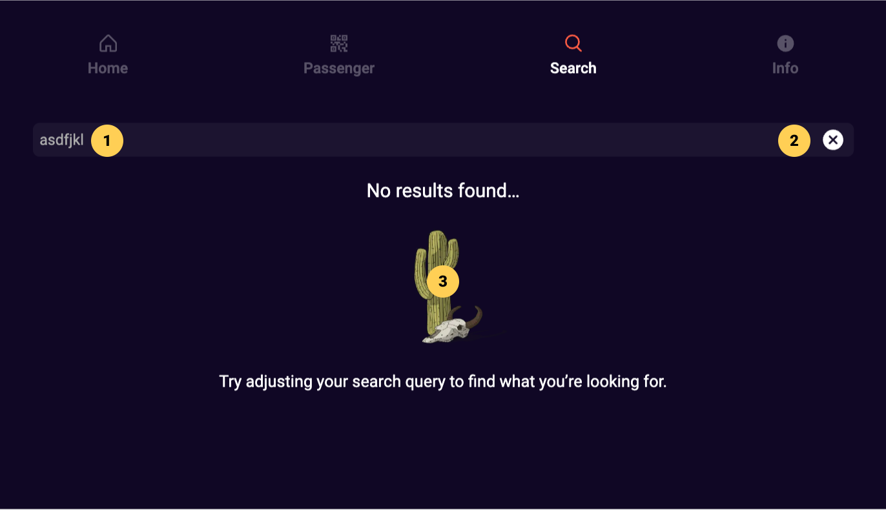

# Search

## Search (no entered search query)

|   # | Description                                                 |
| --: | :---------------------------------------------------------- |
|     | **Search**                                                  |
|   1 | Search field, click to display on-screen keyboard           |
|     | **Browse Library**                                          |
|   2 | Category tabs, click to filter library by selected category |
|   3 | Subcategories display, scroll to view more subcategories    |
|   4 | Subcategory tile, click to browse corresponding content     |

:::note

- The purpose of the Search section is to allow users to both search and browse the whole karaoke library
- When searching for songs, the [result display](#search-results-entered-search-query) will replace the browse categories in the main content area (3) of the screen

:::

## Search Results (entered search query)

|   # | Description                                                                                    |
| --: | :--------------------------------------------------------------------------------------------- |
|     | **Search Field**                                                                               |
|   1 | Search field, click to display on-screen keyboard and enter search query to display results    |
|   2 | Clear button, click to clear the search field                                                  |
|     | **Search Results**                                                                             |
|   3 | Results category, click to view [more](#more-search-results) search results in this category   |
|   4 | More > button, to view [more](#more-search-results) search results in this category            |
|   5 | Results display, scroll to view more results or click Clear search button (2) to clear results |

:::note

- When searching for songs, the [result display](#search-results-entered-search-query) (5) will replace the browse categories; clear the Search field (2) to display the browse categories again
- Search results are displayed in different swimlanes for each result category (Song titles, Songs by artists and Artist names)
- If a search query doesn’t return any results in one or more result categories, corresponding (empty) swimlanes are not displayed

:::

## Search Artist Results

|   # | Description                                                                                  |
| --: | :------------------------------------------------------------------------------------------- |
|     | **Search Field**                                                                             |
|   1 | Search field, click to display on-screen keyboard and enter search query to display results  |
|   2 | Clear button, click to clear the search field                                                |
|     | **Search Results**                                                                           |
|   3 | Results category, click to view [more](#more-search-results) search results in this category |
|   4 | More > button, to view [more](#more-search-results) search results in this category          |
|   5 | Artist Card with name of the artist and number of songs available in karaoke library         |

:::note

- Users can quickly view which which artist songs are available to sing by clicking on an Artist Card

:::

## More Search Results

|   # | Description                                      |
| --: | :----------------------------------------------- |
|   1 | Back button, click to go back to previous screen |
|   2 | Screen title with result category                |
|   3 | Current search query identified between quotes   |
|   4 | Search result cards, scroll to view more         |

## Artist Songs

|   # | Description                                                         |
| --: | :------------------------------------------------------------------ |
|   1 | Back button, click to go back to previous screen                    |
|   2 | Screen title with artist name                                       |
|   3 | Number of songs available by selected artist in the karaoke library |
|   4 | Sing All button, click to add all artist songs to the Song Queue    |
|   5 | Sorting dropdown menu, click to change sorting order                |

## No Results

|   # | Description                                         |
| --: | :-------------------------------------------------- |
|   1 | Search field, enter search query to display results |
|   2 | Clear button, click to clear the search field       |
|   3 | No search results prompt and illustration           |
