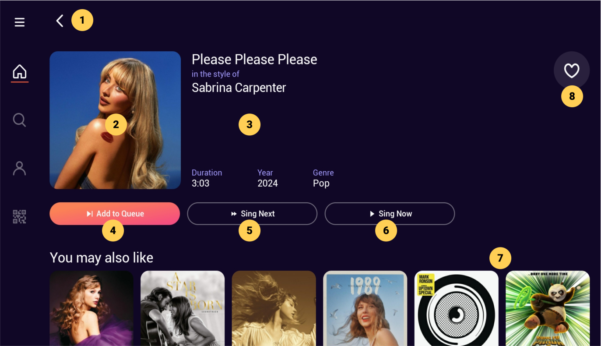

# Song Info

|   # | Description                                                                                                                    |
| --: | :----------------------------------------------------------------------------------------------------------------------------- |
|   1 | Back button, click to go back to previous screen                                                                               |
|   2 | Song thumbnail image                                                                                                           |
|   3 | Song TTA and metadata display                                                                                                  |
|   4 | Add to Queue button, click to append song at last [Song Queue](/docs/Screen%20Descriptions/Song%20Queue) position OR add song at [Song Queue](/docs/Screen%20Descriptions/Song%20Queue) position 1 and start playback immediately ONLY if song queue is empty |
|   5 | Sing Next, click to add song after current [Song Queue](/docs/Screen%20Descriptions/Song%20Queue) position                  |
|   6 | Sing Now, click to add song to [Song Queue](/docs/Screen%20Descriptions/Song%20Queue) and start playback immediately                     |
|   7 | You may also like, related songs swimlane                                                                                                         |
|   8 | Like button, click to add song to Favorites                                                                                                       |

:::note

- The Add to Queue button has the same behavior as the Sing Now button if the [Song Queue](/docs/Screen%20Descriptions/Song%20Queue) is empty
- When the [Song Queue](/docs/Screen%20Descriptions/Song%20Queue) is NOT empty, the Add to Queue button does not go the [Player](/docs/Screen%20Descriptions/Player) screen; it appends the song at the last position and user feedback is given with a green toast component displaying the Successfully added to queue message
- The Sing Now button immediately brings the user to the [Player](/docs/Screen%20Descriptions/Player) screen and automatically starts playing the song
- The Sing Next does not go to the [Player](/docs/Screen%20Descriptions/Player) screen; user feedback is given with a green toast component displaying the Successfully added to queue message

:::
