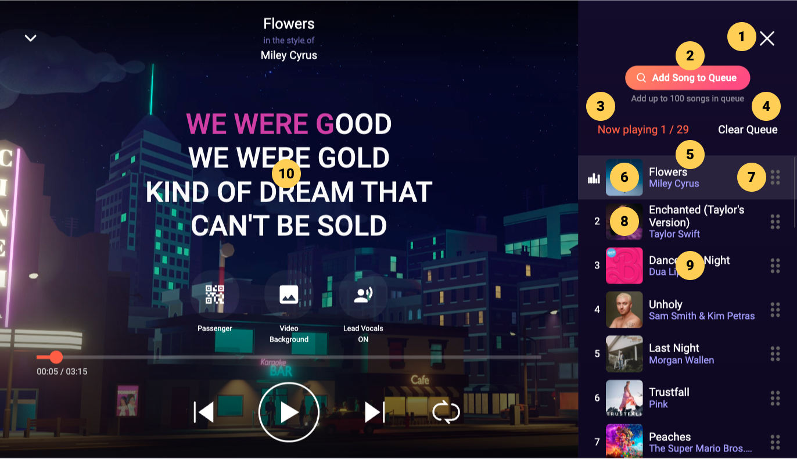
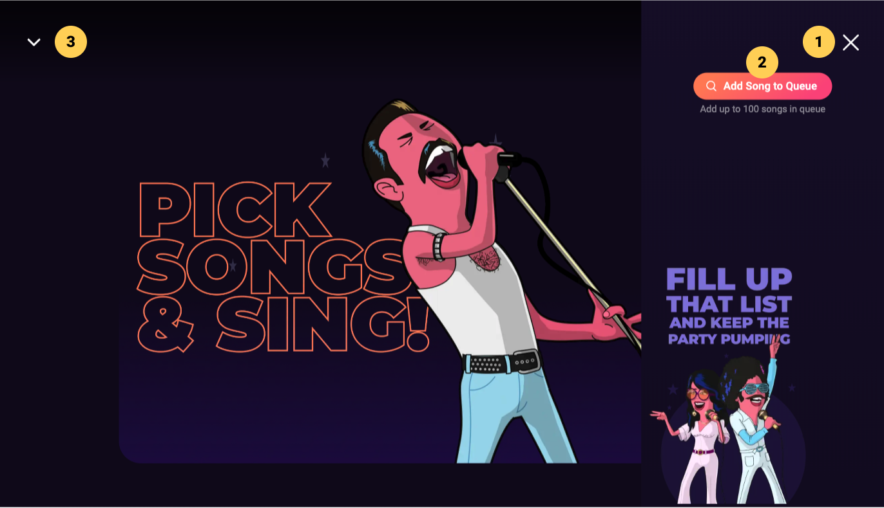

# Song Queue

## Song Queue Display Behavior
The Song Queue can be accessed by clicking the Song Queue button on the Player Screen. The Song Queue button will switch to a close button so the Song Queue can be dismissed after it is displayed. The display behavior of the Song Queue adapts based on the screen's form factor to ensure an optimal user experience.

#### Portrait Mode (Vertical) or Small Screens: 
In portrait mode or when the screen size is too small, the Song Queue will be displayed as an overlay on top of the Player Screen. This approach maximizes the use of available space while still providing easy access to the Song Queue.

#### Landscape Mode (Horizontal): 
When the device is in landscape mode, the Song Queue will appear as a side drawer. This design choice ensures that the lyrics display on the Player Screen remains unobstructed, allowing you to follow along with the song seamlessly.

:::note
By adapting the display method based on the screen orientation and size, the app ensures that you can always enjoy an uninterrupted karaoke experience.
:::

## Song Queue

|   # | Description                                                                        |
| --: | :--------------------------------------------------------------------------------- |
|   1 | Close button, click to close the side panel                                        |
|   2 | Add Song to Queue button, click to search and browse for songs from the side panel |
|   3 | Current / Total song display                                                       |
|   4 | Clear Queue, click to display Clear Song Queue confirmation dialog                 |
|   5 | Song Queue list, scroll to view other songs in queue                               |
|   6 | Current song with animated cursor and light background                             |
|   7 | Drag handle, hold and drag to change song position                                 |
|   8 | Song position indicator                                                            |
|   9 | Song item, click to display queued song options [dialog](#queued-song-options)     |
|  10 | Player                                                                             |

:::note

- Users have access to the song queue from the full screen [player](/docs/Screen%20Descriptions/Player.md) so they can manage it without interrupting the experience
- All Player functionalities are accessible while the Song Queue panel is expanded

:::

## Queued Song Options

|   # | Description                                                             |
| --: | :---------------------------------------------------------------------- |
|   1 | Close button, click to close the Song Options Dialog                    |
|   2 | Selected song thumbnail and TTA                                         |
|   3 | Sing Now button, click to start selected song playback immediately      |
|   4 | Remove from Queue button, click to remove selected song from song queue |

:::note

- The Queued Song Options dialog is overlayed on the Song Queue panel so it doesn’t obfuscate the Player

:::

## Search and Browse Panel

|   # | Description                                                        |
| --: | :----------------------------------------------------------------- |
|   1 | Close button, click to close the side panel                        |
|   2 | Back button, click to go back to previous panel screen             |
|   3 | Search field, click to display on-screen keyboard                  |
|   4 | Browse category tabs, click to filter content by selected category |
|   5 | Category grid, scroll to view more Category Cards                  |
|   6 | Category Cards, click to display corresponding list of songs       |

:::note

- Users can search and browse for songs to add without leaving the player screen

:::

## Browse Category Panel

|   # | Description                                                                               |
| --: | :---------------------------------------------------------------------------------------- |
|   1 | Close button, click to close the side panel                                               |
|   2 | Back button, click to go back to previous panel screen                                    |
|   3 | Selected category name                                                                    |
|   4 | Sort dropdown, click to select a different sorting option                                 |
|   5 | Category songs, click any song to display the Song Options [dialog](#queued-song-options) |

:::note

- Users can search and browse for songs to add without leaving the player screen

:::

## Add Song Options

|   # | Description                                                                |
| --: | :------------------------------------------------------------------------- |
|   1 | Close button, click to close the side panel                                |
|   2 | Back button, click to go back to previous panel screen                     |
|   3 | Selected song thumbnail and TTA                                            |
|   4 | Sing Now button, click to add song to queue and start playback immediately |
|   5 | Sing Next, click to add song after current queue position                  |
|   6 | Sing Last, click to append song at last queue position                     |
|   7 | You may also like, scroll to view related songs                            |

:::tip

- When browsing or searching songs, users may elect to add them for later (next or last) to avoid interrupting the current song

:::

## Search Results Panel

|   # | Description                                                               |
| --: | :------------------------------------------------------------------------ |
|   1 | Close button, click to close the side panel                               |
|   2 | Back button, click to go back to previous panel screen                    |
|   3 | Search field, enter search query to display results                       |
|   4 | Clear button, click to clear the search field                             |
|   5 | Results category, click to view more search results in this category      |
|   6 | More button, click to view more search results in this category           |
|   7 | Results display, click Clear search button to clear results               |
|   8 | Result song, click to display Song Options [dialog](#queued-song-options) |

:::note

- When searching for songs, the result display (7) will replace the [browse](#search-and-browse-panel) categories; clear the Search field (4) to display the browse categories again
- Search results are displayed in different sections for each result category (Song titles, Songs by artists and Artist names)
- If a search query doesn’t return any results in one or more result categories, corresponding (empty) section are not displayed

:::

## More Search Results

|   # | Description                                                          |
| --: | :------------------------------------------------------------------- |
|   1 | Close button, click to close the side panel                          |
|   2 | Back button, click to go back to previous panel screen               |
|   3 | Result category                                                      |
|   4 | Song list, scroll to view more song results                          |
|   5 | Song item, click to view Song Options [dialog](#queued-song-options) |

## Empty Song Queue

|   # | Description                                                                                                 |
| --: | :---------------------------------------------------------------------------------------------------------- |
|   1 | Close button, click to close the side panel                                                                 |
|   2 | Add Song to Queue button, click to [search and browse](#search-and-browse-panel) for songs from the side panel |
|   3 | Player collapse button, click to minimize the full screen player to navigate the rest of the app              |

:::note

- When the Song Queue is empty, no player controls are available and users are prompted to pick songs, which they can still do from the side panel (2) or by collapsing the player (3) to navigate in the rest of the app

:::
