# My Karaoke

## App Info

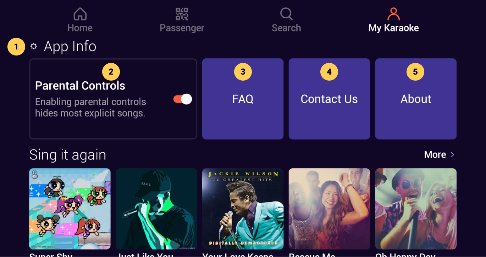

| # | Description |
| --: | :-- |
| 1 | App Info swimlane category |
| 2 | **Parental Controls** On/Off toggle, click switch to hide/show explicit content |
| 3 | [**FAQ**](#faq) card, click to view FAQ content |
| 4 | [**Contact Us**](#contact-us) card, click to view Contact Us info |
| 5 | [**About**](#about) card, click to view About info |

&nbsp;

:::info
- Explicit songs will not be displayed when parental controls are ON unless they are in the **Sing it again** or **Favorites** categories where they will be displayed as a generic, unclickable, locked card without cover art nor labels.

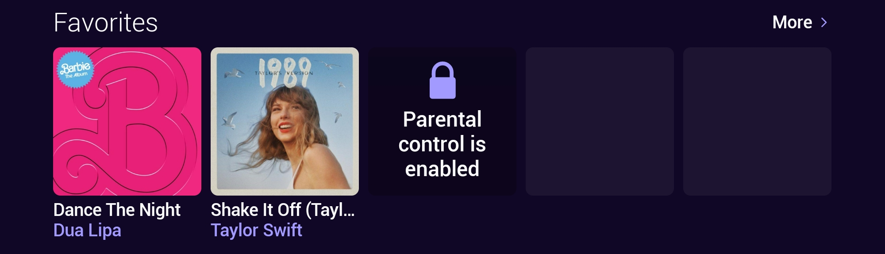
:::

### FAQ

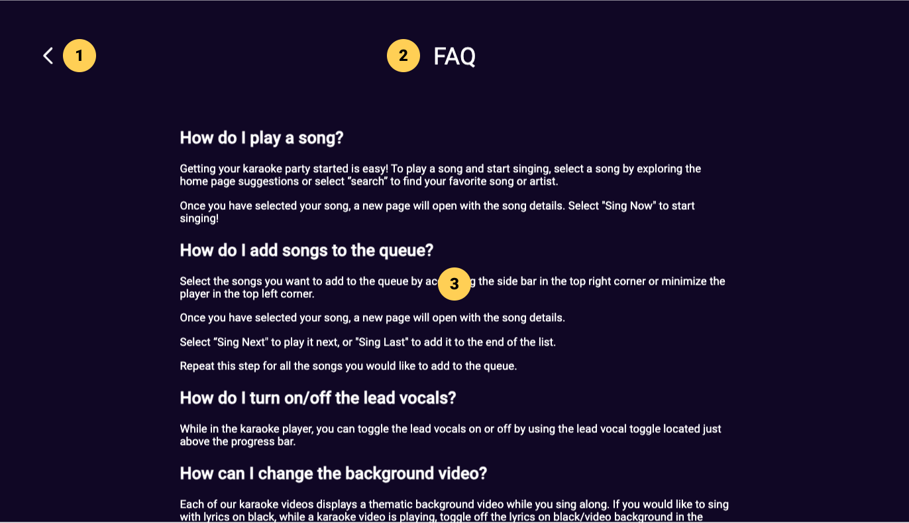

|   # | Description                                      |
| --: | :----------------------------------------------- |
|   1 | **Back** button, click to go back to previous screen |
|   2 | Screen title with Info category name             |
|   3 | FAQ items, scroll to view more                   |

### Contact Us

|   # | Description                                      |
| --: | :----------------------------------------------- |
|   1 | **Back** button, click to go back to previous screen |
|   2 | Screen title with info category name             |
|   3 | Contact info                                     |

### About

|   # | Description                                        |
| --: | :------------------------------------------------- |
|   1 | **Back** button, click to go back to previous screen   |
|   2 | Screen title with info category name               |
|   3 | Version number and copyright info                  |
|   4 | [**Terms and Conditions**](#terms-and-conditions) button, click to view details |
|   5 | [**Privacy Policy**](#privacy-policy) button, click to view details       |

### Terms and Conditions

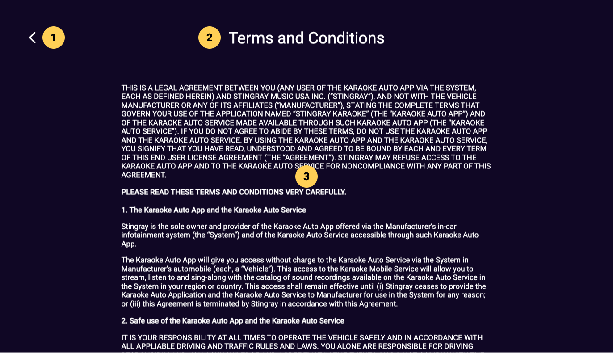

|   # | Description                                      |
| --: | :----------------------------------------------- |
|   1 | **Back** button, click to go back to previous screen |
|   2 | Screen title with info category name             |
|   3 | Terms and Conditions text, scroll to read more   |

### Privacy Policy

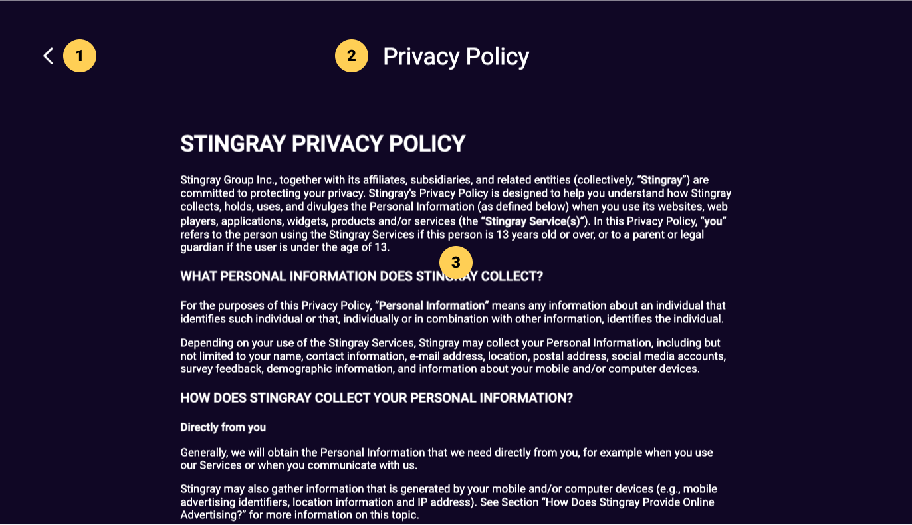

|   # | Description                                      |
| --: | :----------------------------------------------- |
|   1 | **Back** button, click to go back to previous screen |
|   2 | Screen title with info category name             |
|   3 | Privacy Policy text, scroll to read more         |

## Sing it again

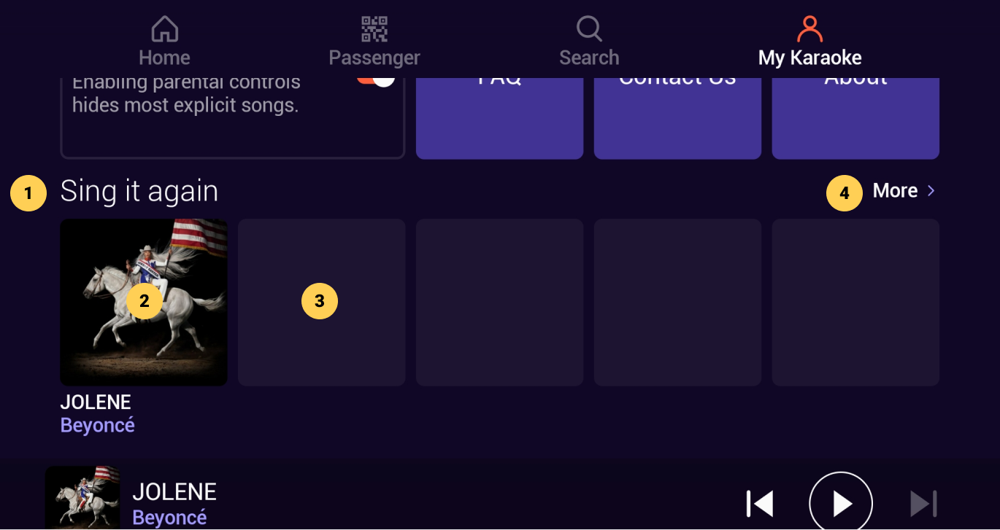

|   # | Description                                          |
| --: | :--------------------------------------------------- |
|   1 | Row category title                                   |
|   2 | Previously played song card(s), from most recent to oldest, click to view [**Song Info**](./Song%20Info.md)                         |
|   3 | Ghost card placeholder                               |
|   4 | More button, click to view [**Sing it again**](#sing-it-again-more) grid screen |

:::info
- The Sing it again category is also displayed on the [**Home**](./Home.md) screen if there is at least one song in the history
- The ghost card placeholders are replaced by song cards as the row is populated with more songs
:::

### Sing it again, More

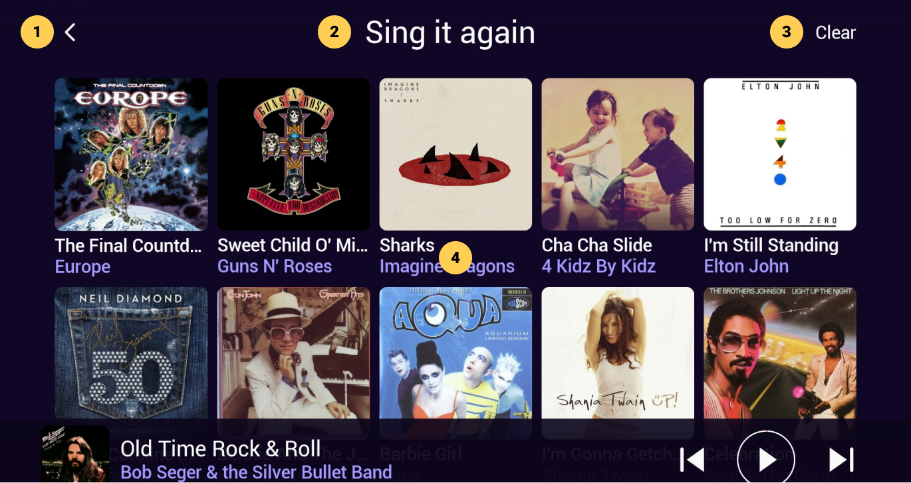

|   # | Description                                                     |
| --: | :-------------------------------------------------------------- |
|   1 | **Back** button, click to go back to previous screen                |
|   2 | Screen title                                                    |
|   3 | Clear button, click to view [**Clear Dialog**](#sing-it-again-clear-dialog) |
|   4 | Previously played song cards, from most recent to oldest        |

### Sing it again, Clear Dialog

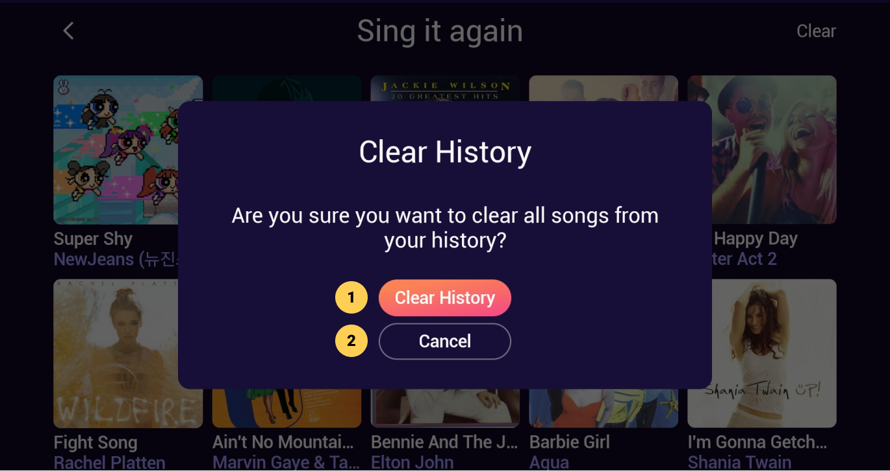

|   # | Description                                   |
| --: | :-------------------------------------------- |
|   1 | **Clear** button, click to reset history with empty list |
|   2 | **Cancel** button, click to close dialog                 |

### Sing it again, Empty

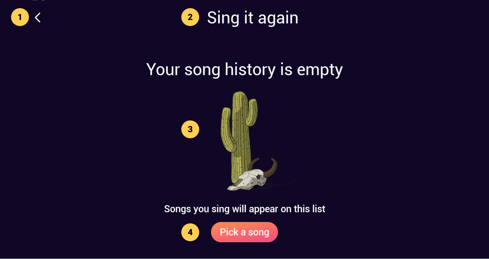

|   # | Description                                      |
| --: | :----------------------------------------------- |
|   1 | **Back** button, click to go back to previous screen |
|   2 | Screen title                                     |
|   3 | Empty song history message and image             |
|   4 | **Pick a song** button, click to select from [Home](./Home.md) screen    |

## Favorites

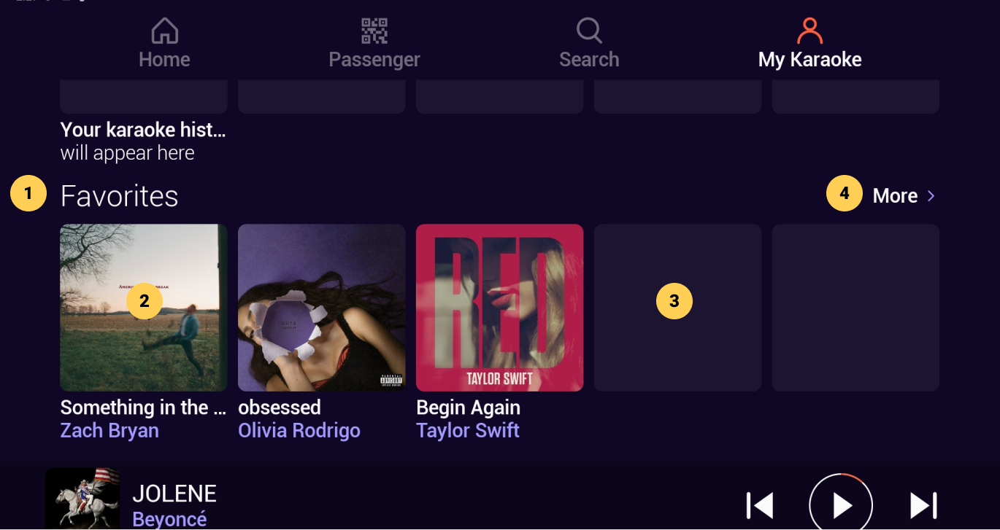

|   # | Description                                          |
| --: | :--------------------------------------------------- |
|   1 | Row category title                                   |
|   2 | Previously liked song card(s)                          |
|   3 | Ghost card placeholder                               |
|   4 | **More** button, click to view [**Favorites**](#favorites) grid screen |

### Favorites, More

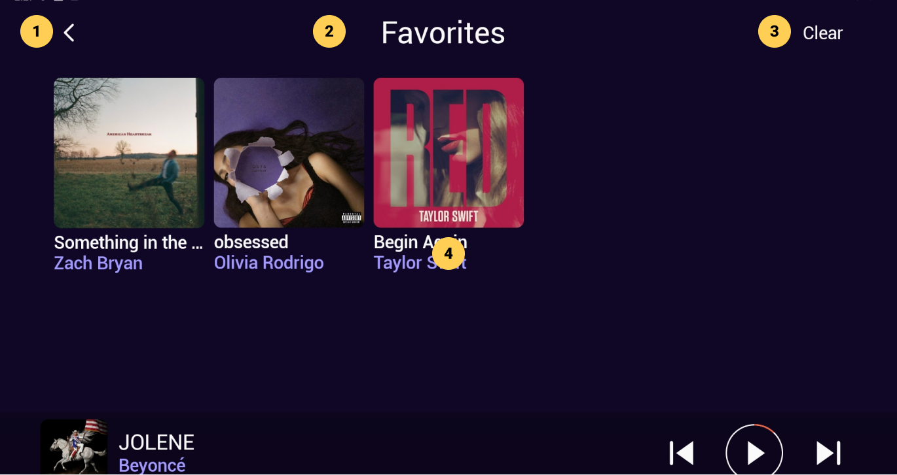

|   # | Description                                                     |
| --: | :-------------------------------------------------------------- |
|   1 | **Back** button, click to go back to previous screen                |
|   2 | Screen title                                                    |
|   3 | **Clear** button, click to view [Clear Dialog](#favorites-clear-dialog) |
|   4 | Previously played song cards, from most recent to oldest        |

### Favorites, Clear Dialog

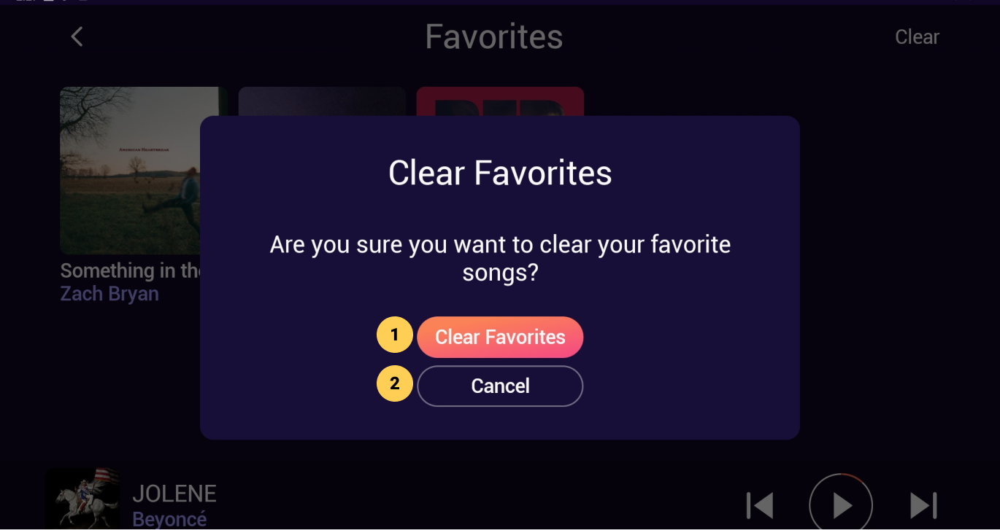

|   # | Description                                   |
| --: | :-------------------------------------------- |
|   1 | **Clear** button, click to reset with empty list |
|   2 | **Cancel** button, click to close dialog                 |

